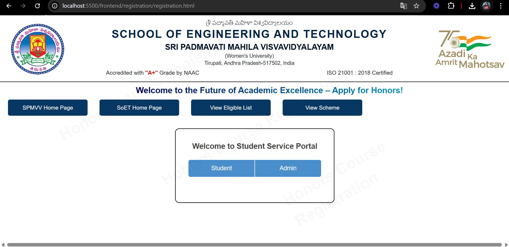
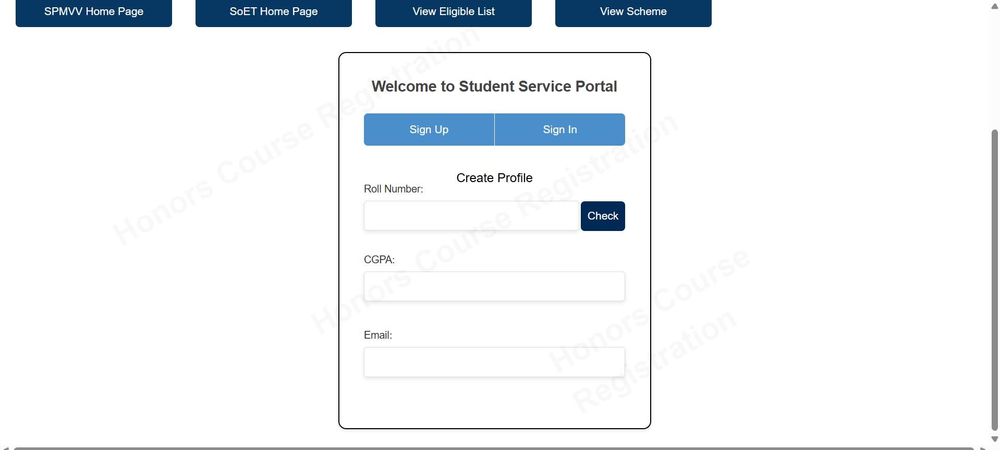
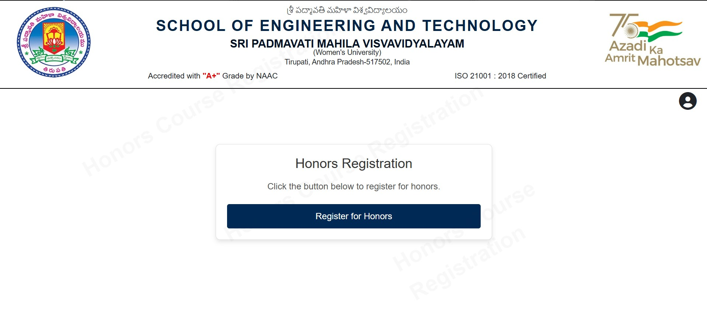
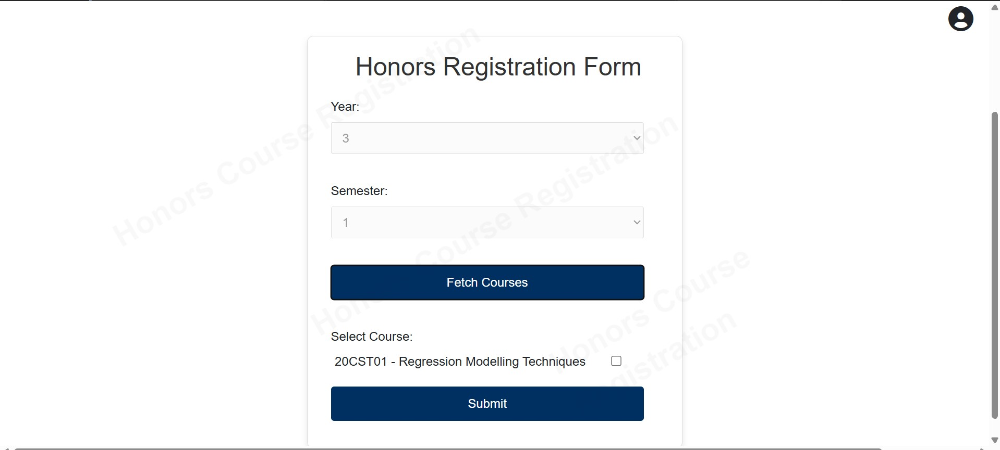
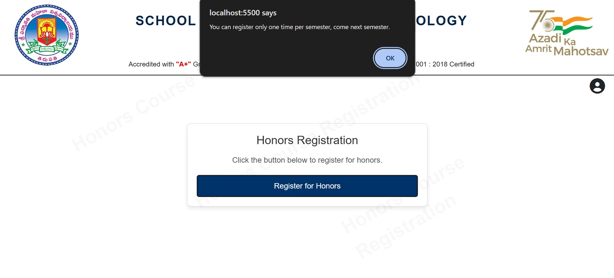
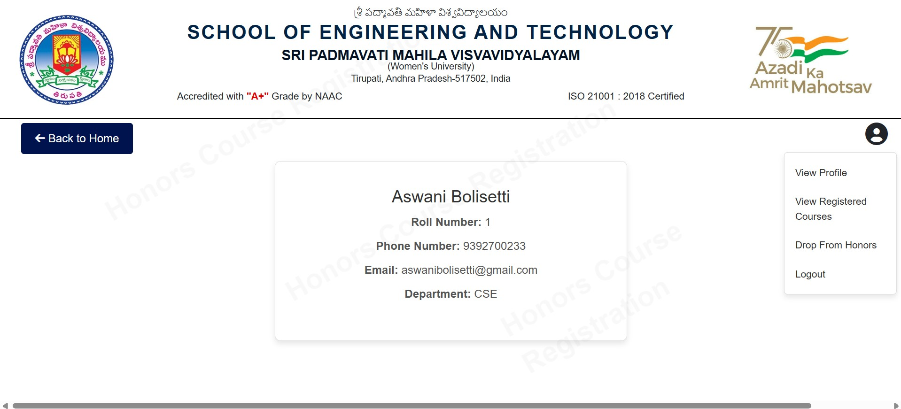
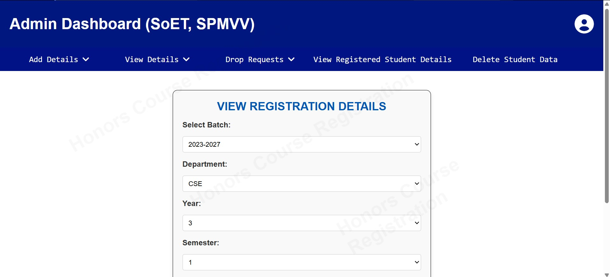
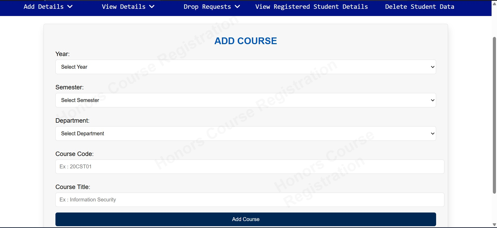
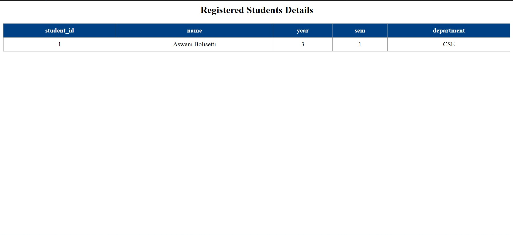

# Honors Course Registration Portal

## Overview

The **Honors Course Registration Portal** is a web-based application that allows students to register for honors courses seamlessly. This project is built using **Node.js, Express.js, MySQL, HTML, CSS, JavaScript, and Bootstrap**.

## Features

- Student registration and login
- Course listing and enrollment
- Admin dashboard for managing courses and students
- Secure authentication using `.env` for database credentials
- Responsive UI with Bootstrap

## Images
| Home Page | Student Signup |
|------------|----------------|
|  |  |

| Student Dashboard | Honors Registration Form|
|-----------------|------------|
|  |  |

| Student Dashboard | Student Profile |
|-----------------|---------------------|
|  |  |

| Admin 1 | Admin 2 |
|--------------------|--------------|
|  |  |



## Technologies Used

- **Backend:** Node.js, Express.js
- **Database:** MySQL
- **Frontend:** HTML, CSS, JavaScript, Bootstrap
- **Environment Variables:** `.env` file for configuration

## Installation

### Prerequisites

Ensure you have the following installed:

- Node.js
- MySQL

### Setup Method 1: Using Git

1. **Clone the Repository:**
   ```sh
   git clone <repository-url>
   cd HonorsRegistration
   ```
2. **Install Dependencies:**
   ```sh
   npm install
   ```
3. **Configure Database:**
   - Create a MySQL database(honors_registration).
   - Import the `honors_registration.sql` file provided in the project folder.
   - Truncate registrations, users, students, cgpa, courses, droprequests, trackcourses 
     tables before starting to use the application. Do not touch/modify or delete any other tables
   - Create `.env` file in the main folder
   - Configure your `.env` file with your database details:
     ```env
     DB_HOST=your_host
     DB_USER=your_user
     DB_PASSWORD=your_password
     DB_NAME=your_database
     ```
   - Ex :
 DB_HOST=localhost
DB_USER=root
DB_PASS=password
DB_NAME=honors_registration

4. **Run the Server:**
   ```sh
   node index.js
   ```
5. **Access the Portal:**
   - The backend server runs on `http://localhost:3000`.
   - The frontend runs using **Go Live** on `http://localhost:5500`. Open this URL in your browser to access the portal.

### Setup Method 2: Using a Pen Drive

1. **Extract the Folder:**
   Copy the project folder from the pen drive to your local system. Open the project in Visual Studio Code (VS Code) for a better development experience.
2. **Install Dependencies:**
   Open a terminal in the project folder and run:
   ```sh
   npm install
   ```
3. **Configure Database:**
   - Create a MySQL database.
   - Import the `honors_registration.sql` file provided in the project folder.
   - Configure your `.env` file with your database details:
     ```env
     DB_HOST=your_host
     DB_USER=your_user
     DB_PASSWORD=your_password
     DB_NAME=your_database
     ```
4. **Run the Server:**
   ```sh
   node index.js
   ```
5. **Access the Portal:**
   - The backend server runs on `http://localhost:3000`.
   - The frontend runs using **Go Live** on `http://localhost:5500`. Open this URL in your browser to access the portal.
